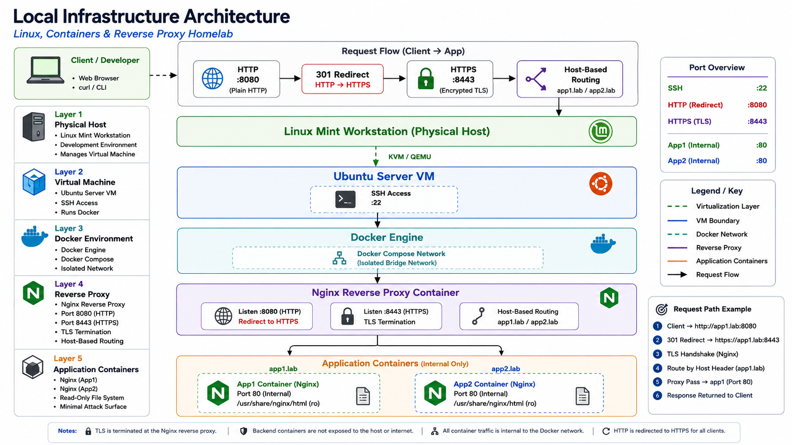

# Linux, Cloud & Security Infrastructure Homelab

A hands-on infrastructure engineering homelab documenting practical experience across Linux administration, containerization, networking, security, cloud infrastructure, and Infrastructure as Code.

The project begins with locally hosted infrastructure on Linux and progressively moves toward AWS, Terraform, automation, monitoring, and infrastructure security.

---

## Current Architecture



The current environment uses a Linux Mint physical host running an Ubuntu Server virtual machine through KVM/QEMU. Docker Compose manages an isolated container network containing an Nginx reverse proxy and two backend application containers.

HTTP requests received on port `8080` are redirected to HTTPS on port `8443`. Nginx terminates TLS and uses hostname-based routing to direct requests for `app1.lab` and `app2.lab` to their respective backend containers.

The backend application containers are not directly exposed through host ports.

The current environment is hosted entirely inside the local homelab and is not publicly exposed to the Internet.

---

## Labs

| # | Lab | Primary Technologies | Status |
|---|---|---|---|
| 01 | [Linux Workstation Migration](docs/01-linux-workstation/README.md) | Linux Mint, UEFI, GRUB, DKMS | Complete |
| 02 | [Ubuntu Server Administration](docs/02-ubuntu-server/README.md) | Ubuntu Server, SSH, systemd | Complete |
| 03 | [Docker Fundamentals](docs/03-docker-fundamentals/README.md) | Docker, Nginx, Bind Mounts | Complete |
| 04 | [Docker Compose](docs/04-docker-compose/README.md) | Docker Compose, YAML | Complete |
| 05 | [Nginx Reverse Proxy](docs/05-reverse-proxy/README.md) | Nginx, Docker Networking | Complete |
| 06 | [Local Hostname Routing](docs/06-local-dns/README.md) | Name Resolution, HTTP, Nginx | Complete |
| 07 | [HTTPS & TLS](docs/07-https-tls/README.md) | OpenSSL, TLS, HTTPS | Complete |
| 08 | [AWS Foundations & Cloud Infrastructure](docs/08-aws-foundations/README.md) | AWS, IAM, VPC, EC2, Docker | Complete |
| 09 | [Terraform Foundations & Infrastructure as Code](docs/09-terraform-foundations/README.md) | Terraform, AWS, cloud-init, Docker | Complete |
| 10 | [Security Hardening & Automation](docs/10-security-hardening/README.md) | SSH, UFW, Docker Security, Terraform | Complete |
| 11 | [Reusable Terraform Modules](docs/11-terraform-modules/README.md) | Terraform Modules, AWS, IaC Architecture | Complete |

---

## Skills Demonstrated

### Linux Administration

- Linux workstation administration
- Ubuntu Server administration
- SSH remote management
- `systemd` service management
- APT package management
- Linux filesystem and permissions
- Kernel and DKMS troubleshooting
- Persistent filesystem mounts

### Containers

- Docker Engine
- Container lifecycle management
- Container logging and inspection
- Docker bind mounts
- Docker networking
- Docker Compose
- Declarative service configuration
- Restart policies

### Networking

- TCP/IP fundamentals
- Host and container port mapping
- Local hostname resolution
- HTTP request routing
- HTTP Host headers
- Nginx virtual hosting
- Docker service discovery
- Reverse proxy architecture

### Security

- TLS/HTTPS
- Encryption in transit
- X.509 certificates
- Private-key handling
- TLS termination
- Least-privilege read-only mounts
- Secret exclusion from source control
- SSH host verification
- Infrastructure attack-surface reduction

### DevOps & Infrastructure Practices

- Git version control
- GitHub repository management
- SSH-based Git authentication
- Markdown technical documentation
- Configuration as Code
- Declarative infrastructure concepts
- Infrastructure troubleshooting
- Reproducible lab environments

---

## Repository Structure

```text
infrastructure-homelab/
│
├── README.md
│
├── docs/
│   ├── 01-linux-workstation/
│   ├── 02-ubuntu-server/
│   ├── 03-docker-fundamentals/
│   ├── 04-docker-compose/
│   ├── 05-reverse-proxy/
│   ├── 06-local-dns/
│   ├── 07-https-tls/
│   └── 08-aws-foundations/
│
├── docker/
│   ├── nginx-site/
│   └── reverse-proxy/
│
├── terraform/
│   └── aws/
│
├── scripts/
│
└── diagrams/
```

---

## Troubleshooting Philosophy

The labs emphasize identifying the failing infrastructure layer before changing configuration.

For a containerized web application, the troubleshooting process generally follows:

```text
Client
  |
  v
Name Resolution
  |
  v
Network Connectivity
  |
  v
Host Port
  |
  v
Docker
  |
  v
Reverse Proxy
  |
  v
Application Routing
  |
  v
Backend Service
```

This methodology was used to diagnose issues including:

- Docker socket permissions
- Host port conflicts
- Reverse proxy startup failures
- HTTP 404 responses
- Nginx path-routing behavior
- Hostname resolution
- TLS certificate trust

---

## Security Approach

Security is treated as part of infrastructure design rather than an isolated final step.

The repository intentionally excludes sensitive material including:

```text
Private keys
Cloud credentials
Secrets
Tokens
Local TLS certificate material
Terraform state
```

Configuration committed to this repository is intended to remain reproducible without exposing environment-specific secrets.

---

## Roadmap

### Phase I — Local Infrastructure

- [x] Linux workstation
- [x] Ubuntu Server
- [x] SSH administration
- [x] Docker
- [x] Docker Compose
- [x] Reverse proxy
- [x] Local hostname routing
- [x] HTTPS/TLS

### Phase II — AWS Infrastructure

- [x] AWS identity and access foundation
- [x] IAM configuration
- [x] VPC networking
- [x] Public/private subnets
- [x] Security groups
- [x] EC2 deployment
- [x] Cloud-hosted application
- [x] CloudWatch monitoring

### Phase III — Infrastructure as Code

- [x] Terraform fundamentals
- [x] AWS provider configuration
- [x] VPC deployment with Terraform
- [x] EC2 deployment with Terraform
- [x] Terraform state fundamentals
- [x] Variables and outputs
- [x] Reusable modules
- [ ] Remote state and locking

### Phase IV — Infrastructure Security Hardening

- [x] SSH hardening
- [x] Host firewall with UFW
- [x] Linux privilege review
- [x] Docker privilege hardening
- [x] Patch management
- [x] Automatic security updates
- [x] Secrets and sensitive-data review
- [x] Security validation and negative testing
- [x] Hardening automation with cloud-init
- [x] Terraform replacement on bootstrap change
- [x] Reproducible hardened EC2 deployment
---

## Purpose

This repository serves as both a learning environment and technical portfolio.

Each lab documents:

- The objective
- Architecture
- Implementation
- Meaning of the technologies used
- Problems encountered
- Troubleshooting methodology
- Security considerations
- Lessons learned
- Real-world application

The long-term objective is to progressively evolve the environment from a local Linux homelab into reproducible, secure cloud infrastructure.
